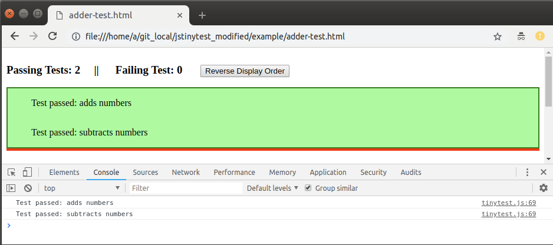
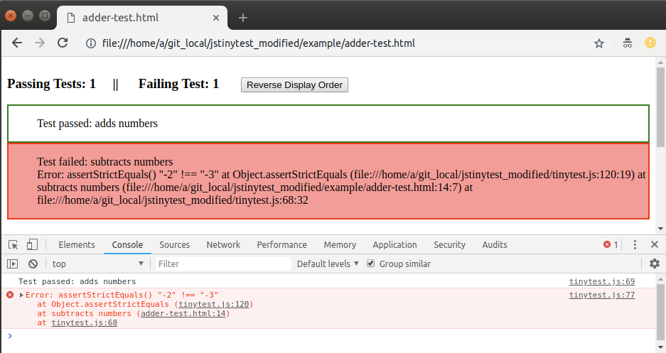

Puny JavaScript unit testing library
=======================================

This is a a fork of the brilliant `jstinytest` to add node-support.
It is a great library to use when writing unit tests for smaller projects where a gigantic testing framework such as `jest` would be overkill.

## How to use it
Simply copy `jspunytest.js` into your node project.

Then create your unit-tests in stand-alone files:

```javascript
// node-usage.js
var {
    fail, assert, assertEquals, assertStrictEquals, tests
} = require("./punytest.js");

tests({
    "foobar" : function foo() {
        var expected = 42;
        var actual = 21 * 2;
        assertEquals(expected, actual);
    }
});
```

Run your tests with `node`:

```bash
$ node example/node-usage.js
Test: foobar OK                                                                                                     
Tests: 1 passed, 1 total
```

* That's it!

## Features
* Supports Node v8.x or later.
* Backwards compatible with `jstinytest`.
* Web version still works as usual.

## Original readme below
This is an in-browser JavaScript library I've been using for years. It's so small and simple that it never occurred to me to open source it until I saw all the overly complicated alternatives that are out there.

If you're looking for a JavaScript library full of features or install guides that say things like `grunt`, `npm` or `bower`, you've come to the wrong place. Sorry, this probably isn't for you. Move along now.

If you're looking for a quick way to unit-test a JavaScript function/object in a web-page and don't want to get bogged down in frameworks, you've come to the right place. Take a seat... no scratch that, you'll have everything you need in a few seconds so you may as well remain standing.

*   [Download punytest.js](https://rawgit.com/ullenius/jspunytest/master/tinytest.js)
*   [Example](https://github.com/ullenius/jspunytest/tree/master/example)

10 second tutorial
------------------

Download [punytest.js](https://rawgit.com/ullenius/jspunytest/master/punytest.js) and put it somewhere in your web directory.

Let's say you have a function in `adder.js`:

```javascript
function add(a, b) {
  return a + b;
}
```

Create a test page called `adder-test.html` (you can name it anything). This includes your code under test, `punytest.js` and defines your tests:

```html
<script src="tinytest.js"></script>
<script src="adder.js"></script>
<script>
 tests({

   'adds numbers': function() {
     assertEquals(6, add(2, 4));
     assertEquals(6.4, add(2.4, 4));
   },

   'subtracts numbers': function() {
     assertEquals(-2, add(2, -4));
   },

 });
</script>
```

Open the page in your browser. Green is good. Red is bad. If it's red, look in the JavaScript console for messages.



**That's it!**

Don't believe me? Here's the [source](https://github.com/ullenius/jspunytest/tree/master/example) and [result](https://rawgit.com/ullenius/jspunytest/master/example/adder-test.html).

What else?
==========

If your tests fail, you'll get stack traces:



Function reference
------------------

```javascript
// Force a failure
fail(reason);

// Assert expression is truthy (fail with reason)
assert(expression, reason);

// Assert expected == actual
assertEquals(expected, actual)
eq(expected, actual) // Alias for assertEquals

// Assert expected === actual
assertStrictEquals(expected, actual)
```

Errm that's it. Now stop wasting time - go test that function.

But, but, but. What about feature X?
------------------------------------

It probably doesn't have it. If you need that, you'll probably find it in one of the many more sophisticated frameworks out there. A more detailed discussion can be found [here](http://www.pinterest.com/pin/61431982391077742/).

## Licence
MIT licence.

## Credits
Original code copyright 2008-2014 Joe Walnes and contributors.
